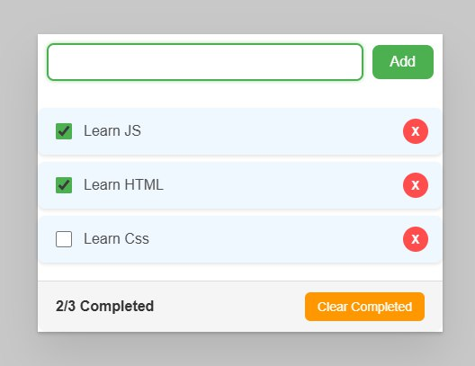

#  Todo React App

A simple ToDo list application built with React.  
This project helps you manage your daily tasks and keep track of what you've completed.

---

##  Features

-  Add new tasks quickly  
-  Mark tasks as completed  
-  Delete tasks  
-  Clean and responsive UI  
-  All data saved during your session  

---

## Screenshot



---

## Getting Started

Follow these instructions to run the project locally:

1. **Clone the repository**

```bash
git clone https://github.com/ItsAnie/todo-react-app.git
cd todo-react-app
